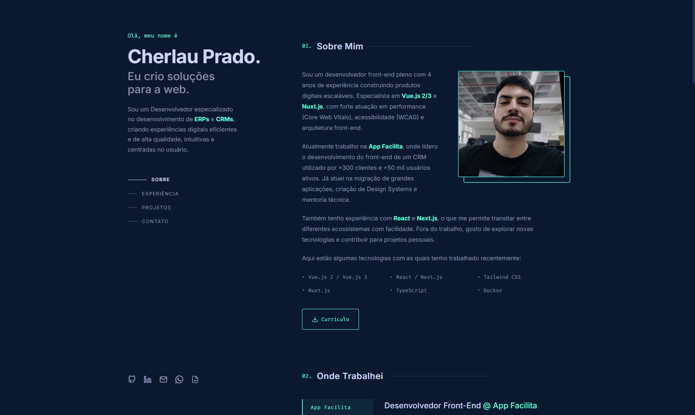

<div align="center">
  
</div>
<h1 align="center">
  cherlau.com
</h1>
<p align="center">
  Portfólio pessoal de <a href="https://cherlau.com" target="_blank">Cherlau Prado</a>, desenvolvido com <a href="https://developer.mozilla.org/pt-BR/docs/Web/HTML" target="_blank">HTML</a>, <a href="https://developer.mozilla.org/pt-BR/docs/Web/CSS" target="_blank">CSS</a> e <a href="https://developer.mozilla.org/pt-BR/docs/Web/JavaScript" target="_blank">JavaScript</a> puro, sem frameworks ou dependências de build.
</p>



## 🚨 Forking this repo (please read!)

Fico feliz que você tenha se interessado pelo meu portfólio! Se quiser usar este código como base para o seu próprio site, a resposta é geralmente **sim, com atribuição**.

Valorizo manter meu site como código aberto, mas _**plágio não é legal**_. Dediquei tempo e esforço consideráveis para construir e desenhar este portfólio, e tenho muito orgulho dele. Tudo que peço é que não reivindique este trabalho como seu.

### TL;DR

Sim, você pode fazer fork deste repositório. Por favor, me dê o devido crédito linkando de volta para [cherlau.com](https://cherlau.com). Obrigado!

## 🛠 Installation & Set Up

Por ser um projeto em HTML, CSS e JavaScript puro, não há processo de build. Você pode rodá-lo de duas formas:

1. **Abrindo diretamente no navegador**

   Basta abrir o arquivo `index.html` diretamente no seu navegador.

2. **Usando um servidor local** (recomendado para evitar problemas com CORS)

   Com a extensão [Live Server](https://marketplace.visualstudio.com/items?itemName=ritwickdey.LiveServer) no VS Code, clique em **"Go Live"** na barra de status inferior.

   Ou via `npx`:

   ```sh
   npx serve .
   ```

   Acesse em `http://localhost:3000`

## 🚀 Building and Running for Production

Por não depender de um bundler, não há etapa de build. Basta hospedar os arquivos estáticos em qualquer serviço de hosting:

1. Faça upload dos arquivos para seu serviço de hospedagem preferido (Netlify, Vercel, GitHub Pages, etc.)

2. Garanta que a estrutura de pastas esteja preservada:

   ```
   /
   ├── index.html
   ├── css/
   │   └── style.css
   ├── js/
   │   └── main.js
   └── assets/
   ```

## 🎨 Color Reference

| Color         | Hex                                                                  |
| ------------- | -------------------------------------------------------------------- |
| Navy          |  `#0a192f` |
| Light Navy    |  `#112240` |
| Lightest Navy |  `#233554` |
| Slate         |  `#8892b0` |
| Light Slate   |  `#a8b2d8` |
| White         |  `#ccd6f6` |
| Green         |  `#64ffda` |
